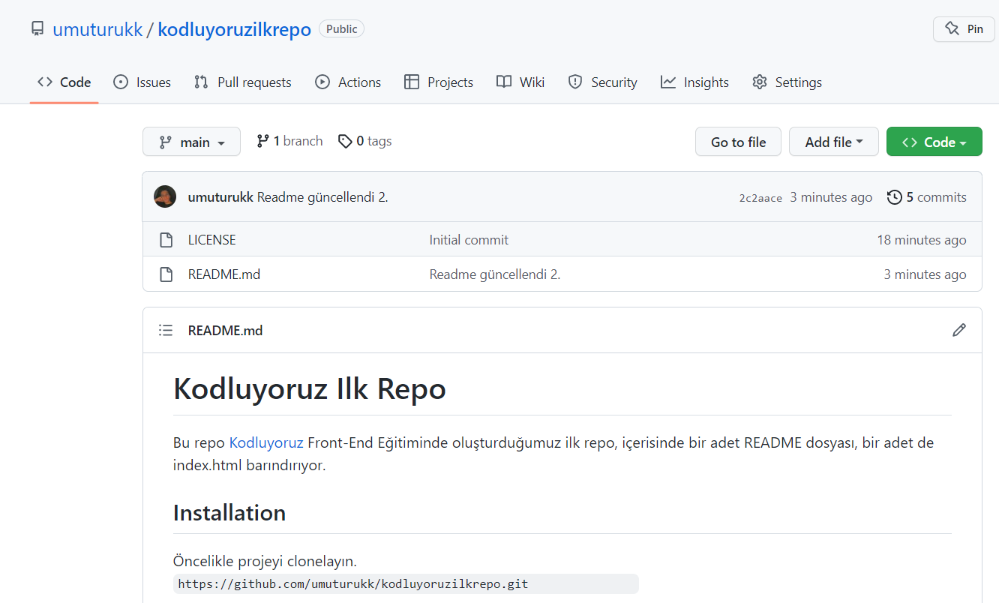

# Kodluyoruz Ilk Repo
Bu repo [Kodluyoruz](https://kodluyoruz.org/) Front-End Eğitiminde oluşturduğumuz ilk repo, içerisinde bir adet README dosyası, bir adet de index.html barındırıyor.   



## Installation
Öncelikle projeyi clonelayın.  
```code
https://github.com/umuturukk/kodluyoruzilkrepo.git
```

## Usage
Projeyi cloneladıktan sonra Visual Studio Code programında açınız.

Linux için:
```
cd kodluyoruzilkrepo
code .
```

## Contributing
Pull requestler kabul edilir. Büyük değişiklikler için, lütfen önce neyi değiştirmek istediğinizi tartışmak için bir konu açınız.

## License
[MIT](https://choosealicense.com/licenses/mit/)